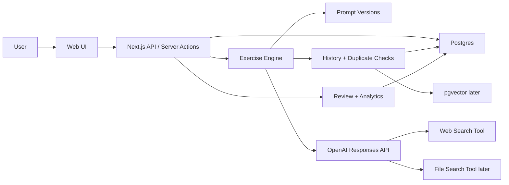

# START_HERE: Brain Gym Training Platform

## Purpose

Build a small web application that replaces the current ad hoc ChatGPT workflow for daily reasoning practice.

The app should:

- Generate new exercises across three training modes.
- Store the original problem, the user's response, the scoring result, and all useful metadata.
- Remember previous work so it can avoid repeats and adapt difficulty.
- Give strict feedback with stable rubrics.
- Keep the daily workflow fast enough for a 45 minute Monday-Friday routine, with a longer review on Saturday.

This is not a generic "brain game" app. It is a deliberate-practice tool for improving judgment, clarity, signal/noise filtering, technical response quality, and principal-level reasoning.

## Source Material

Seed material used for this plan:

- `/Users/jzfre/Desktop/base_prompt.txt`
- `/Users/jzfre/Code/personal/rust/playa/conversation.txt`
- `/Users/jzfre/Downloads/comunication.txt`

At the time this file was first created, `conversation.txt` was empty. The useful context came from `base_prompt.txt`, which describes the training goal, schedule constraints, scoring preferences, and prior "Claim-Evidence-Assumptions Memo" rubric.

`comunication.txt` is important because it shows the expected exercise and feedback format. It includes a full technical incident scenario, the user's answer, strict scoring, model feedback, and a follow-up LSAT drill format. Treat it as the format reference for incident response and LSAT workflows.

## Training Modes

### 1. Memo Extraction

Goal: train clear thinking from ambiguous real-world material.

Typical exercise:

- The app provides a short article, situation, argument, or decision scenario.
- The user extracts the main claim, evidence, assumptions, tradeoffs, and next test.
- The app scores the memo and gives specific improvements.

Core scoring dimensions:

- Claim clarity
- Evidence quality
- Assumptions
- Tradeoffs
- Testability
- What would change my mind

### 2. Technical Incident Response

Goal: train calm, structured thinking under operational pressure.

Typical exercise:

- The app generates a realistic incident scenario: symptoms, timeline, logs, metrics, constraints, stakeholders.
- The user writes an incident response: triage, hypotheses, immediate mitigation, communication, root-cause plan, prevention.
- The app scores response quality and highlights gaps.

Core scoring dimensions:

- Problem framing
- Triage and prioritization
- Hypothesis quality
- Mitigation plan
- Communication clarity
- Prevention and follow-up

### 3. LSAT-Style Logical Reasoning

Goal: train precise argument analysis under constrained time.

Typical exercise:

- The app generates an original LSAT-style logical reasoning question.
- The user selects an answer and explains why.
- The app scores correctness, reasoning, and error pattern.

Important copyright rule:

- Do not scrape or copy paid LSAT questions.
- Either link to official public samples, or generate original LSAT-style questions.
- Store generated questions and answer keys so the app can avoid semantic repeats.

## Difficulty Levels

Every generated problem should support a user-selected difficulty:

- `easy`
- `medium`
- `hard`

Difficulty should change the amount of ambiguity, number of moving parts, and scoring strictness, not the answer format.

Expected behavior:

- `easy`: clearer signal, fewer distractors, simpler math, more direct question stems.
- `medium`: realistic ambiguity, several plausible distractions, moderate numerical or logical traps.
- `hard`: higher ambiguity, interacting causes, stronger distractors, harder tradeoffs, stricter scoring.

For Memo Extraction specifically, difficulty controls where the thinking happens:

- `easy` (25 min): the answers are stated in the article — a strong memo can mostly be assembled by extracting and reorganizing the text.
- `medium` (35 min): the article provides raw material but the key answers are only implied — the user must form their own claim, assumptions, and tradeoffs.
- `hard` (45 min): the article contains substantial irrelevant or distracting detail — the key findings must be the user's own and are not stated in the article.

For LSAT Logical Reasoning, difficulty controls volume and question toughness (5 min/question):

- `easy` (5 questions, 25 min): warm-up — common question types, compact stimuli, distractors that fail on a careful read.
- `medium` (9 questions, 45 min): full session — wide type rotation, denser stimuli, attractive distractors.
- `hard` (9 questions, 45 min): full session of genuinely hard items — Parallel reasoning/flaw, Principle, formal-logic chains, quantifier/modal traps, near-miss distractors.

The UI should allow the user to choose difficulty before generating a problem. Store the selected difficulty with the problem so analytics can compare scores fairly.

Default difficulty should be `medium`.

## Expected Format Contracts

The app should preserve the style shown in `/Users/jzfre/Downloads/comunication.txt`. The point is not only to generate exercises, but to generate them in a repeatable training format.

### Technical Incident Scenario Format

A generated incident should use this structure:

```text
Technical Scenario #N - Short title

Timebox: 45 minutes

Suggested split:
- 7 min read
- 25 min answer
- 8 min numerical sanity check
- 5 min revise

Target score: 6-7/10

Context
...

System flow
...

Supporting systems
...

Normal behavior
...

Current incident
...

Metrics
...

Recent changes
...

More observations
...

Numerical sanity check
...

Your task

Respond as incident lead.

Use this structure:

1. Problem framing
2. Most important signals
3. Primary hypothesis
4. Alternative hypotheses
5. Immediate containment - next 30 minutes
6. Customer prioritization
7. Rollback/config decision
8. What you would not do
9. Numerical sanity check
10. Validation
11. Follow-up prevention
```

Rules for incident generation:

- Do not include hints by default. The user explicitly disliked hints in the example conversation.
- Include enough metrics for order-of-magnitude reasoning.
- Include at least two plausible-but-dangerous suggestions from engineers, sales, product, or an AI assistant.
- Include at least three recent changes, with one true contributor, one partial contributor, and one distraction.
- Make the obvious fix dangerous.
- Force the user to reason about containment, not just root cause.
- Prefer specific operational vocabulary: "retry amplification", "client-side rate limit", "workload isolation", "queue age", "vendor quota", "backpressure", "circuit breaker", "in-flight requests".
- English feedback should focus on operational precision, not elegant wording.

### Technical Incident Evaluation Format

The evaluator should return strict feedback in this style:

```text
Overall: 6.5/10

Short diagnosis:
You found the bottleneck, but containment was too soft and too dependent on the vendor.

Score

1. Problem framing - 8/10
What was good.
Sharper version.

2. Signals - 8/10
What mattered.
What was missing.

...

Strong answer sketch
...

Main next rep
...
```

The incident evaluator should score these dimensions:

- Problem framing
- Signal selection
- Primary hypothesis
- Alternative hypotheses
- Immediate containment
- Customer prioritization/fairness
- Rollback/config decision
- Rejected bad ideas
- Numerical sanity check
- Validation/stabilization criteria
- Follow-up prevention

The feedback should explicitly identify the user's main gap. In the reference conversation, the key gap was containment discipline: reduce pressure, reduce amplification, isolate customers, then drain safely.

### LSAT Drill Format

A generated LSAT drill should use this structure:

```text
LSAT Logical Reasoning Drill #N

Total time: 42 minutes

Suggested pacing:
- Q1-Q5: 5 minutes each
- Q6-Q8: 6 minutes each

Rules:
- One pass.
- No internet.
- Read all answer choices unless completely certain.
- Answer with letter + 1-2 sentence reason.
- Measure your time.

Send back:
1. A - reason
2. D - reason
...

Question 1 - Necessary Assumption
Time limit: 5 minutes

Stimulus...

Which one of the following...

A. ...
B. ...
C. ...
D. ...
E. ...
```

LSAT drills should include a mix of question types:

- Necessary assumption
- Sufficient assumption
- Flaw
- Weaken
- Strengthen
- Evaluate the argument
- Inference
- Principle
- Parallel reasoning
- Parallel flaw

The LSAT evaluator should score hard and classify misses as one or more of:

- English/comprehension issue
- Logic issue
- Question-type confusion
- Trap answer too strong
- Trap answer too narrow
- Wrong conclusion identified
- Quantifier/modal mistake

### Memo Extraction Format

Memo extraction should remain compact. The expected answer template should be:

```text
1. Claim
2. Evidence
3. Assumptions
4. Tradeoffs
5. Next test
6. What would change my mind
```

The evaluator should score:

- Claim clarity
- Evidence quality
- Assumptions
- Tradeoffs
- Testability
- What would change my mind

Feedback should include:

- Overall score
- Brief rationale by dimension
- An example of a strong response per dimension
- Top 3 fixes
- Improved claim
- 2 missing assumptions
- 2 missing tradeoffs
- Better phrasing for weak/fake evidence
- One next rep
- At most one clarification question

## Product Principles

- Persist everything. The database is the source of truth, not an AI chat context window.
- Use stable rubrics. The app should be comparable over weeks and months.
- Prefer daily reps over novelty. The exercise types and answer formats should remain stable while difficulty moves through `easy`, `medium`, and `hard`.
- Avoid repeats using structured metadata first, then semantic similarity.
- Keep feedback direct and short. The user wants strict scoring, top fixes, rewrites, and a next rep.
- Track model behavior. Store prompts, model names, outputs, source URLs, token usage, and evaluation versions.

## Recommended MVP Stack

Use a simple full-stack TypeScript application:

- Frontend/backend: Next.js App Router
- Language: TypeScript
- Database: Postgres
- ORM: Prisma or Drizzle
- Local database: Docker Compose Postgres
- Semantic memory later: Postgres `pgvector`
- AI API: OpenAI Responses API through the official JS SDK
- UI: basic responsive web UI first; Tailwind is enough

Why Postgres instead of Mongo:

- The core data is relational: problems, attempts, evaluations, scores, sources, prompt versions, model runs.
- Score analytics are easier in SQL.
- JSONB still allows flexible rubric payloads.
- `pgvector` can later add semantic search without adding a separate vector database.

Mongo would work, but it does not give a meaningful advantage for this product.

## OpenAI API Direction

Use the Responses API for model calls. Current OpenAI docs recommend the Responses API for reasoning, tool use, and multi-turn/stateful workflows. The docs also describe hosted tools such as web search and file search, plus structured outputs for schema-constrained model responses.

Model configuration should be environment-driven:

```env
OPENAI_API_KEY=...
OPENAI_MODEL=gpt-5.5
OPENAI_REASONING_EFFORT=medium
```

At the time this document was created, OpenAI's latest-model guide points to `gpt-5.5`. Do not hardcode that forever. Keep the model slug configurable and benchmark quality/cost before changing it.

Recommended model usage:

- Problem generation: frontier model, `reasoning.effort=medium`, web search enabled only when needed.
- Evaluation/scoring: frontier model, structured output, usually no web search.
- History summarization: cheaper/faster model if cost becomes meaningful.
- Duplicate classification: embeddings or lower-cost model after MVP.

Use Structured Outputs for both generated problems and evaluations. The app should not parse free-form feedback when it can require a schema.

## Web Search Usage

Use web search for:

- Memo extraction exercises based on current articles.
- Technical incident scenarios inspired by recent public engineering incidents or current cloud/platform behavior.
- Source discovery when the user wants fresh material.

Do not use web search for:

- Evaluating the user's memo unless the task requires source verification.
- LSAT-style generated questions, unless sourcing a public official example link.

When web search is used:

- Store cited URLs.
- Store page titles, snippets, and retrieval timestamp.
- Display citations in the UI.
- Prevent generating from the same source URL too often.

## Do We Need RAG?

Short answer: not for the first MVP. Use the relational database first.

The app needs memory, but "memory" does not automatically mean RAG. For the first version, most memory should be structured:

- Last exercise dates
- Exercise type
- Topic
- Difficulty (`easy`, `medium`, `hard`)
- Source URL
- Tags
- Score dimensions
- Weakness patterns
- Prompt version
- Duplicate hash

That is enough to avoid obvious repeats and personalize the next task.

Add semantic retrieval after the base product works:

- Use embeddings plus `pgvector` in Postgres.
- Embed problems, source summaries, attempts, and evaluation summaries.
- Before generating a new problem, retrieve similar prior problems and tell the generator what to avoid.
- After scoring, retrieve related past mistakes and include one compact pattern in the feedback.

Use OpenAI file search only for more static reference material:

- Base prompt
- Rubrics
- Curated source packs
- Official docs or saved articles

For dynamic app data, `pgvector` inside Postgres is simpler because it lives next to the attempts, scores, and metadata.

## Architecture



### Main Components

1. Web UI

- Today's exercise
- Exercise type selector
- Timer
- Answer editor
- Submit button
- Score and feedback display
- History
- Weekly review
- Prompt/admin page

2. API layer

- Generates problems
- Saves attempts
- Runs evaluations
- Returns history and analytics
- Manages prompt versions

3. Exercise engine

- One generator and evaluator per exercise type
- Shared duplicate prevention
- Shared model-call logging
- Shared structured output validation

4. Database

- Durable source of truth
- Stores every problem, attempt, score, source, and model call
- Supports analytics and future semantic memory

5. AI integration

- Calls the OpenAI Responses API
- Uses web search for fresh exercises
- Uses structured outputs for reliable storage
- Logs raw request/response metadata for debugging and calibration

## Core Workflows

### Generate Problem

1. User chooses exercise type or clicks "Today".
2. Backend loads:
   - User profile
   - Active rubric
   - Recent problems
   - Recent weak dimensions
   - Source/topic cooldowns
   - Similar prior items if semantic memory is enabled
3. Backend calls the generator prompt.
4. Model returns structured problem data.
5. Backend validates schema and checks duplicates.
6. If duplicate risk is high, regenerate once with explicit avoidance notes.
7. Store problem, sources, answer key, rubric version, model run metadata.
8. Return user-visible problem. Keep answer key hidden.

### Submit Attempt

1. User writes answer.
2. Backend stores raw attempt immediately.
3. Backend calls evaluator with:
   - Problem
   - Hidden answer key or ideal response
   - User answer
   - Active rubric
   - Recent weakness pattern, if useful
4. Model returns structured scoring.
5. Backend stores overall score, dimension scores, feedback, next rep, model metadata.
6. UI shows concise feedback.

### Weekly Review

1. Aggregate the last week by exercise type and score dimension.
2. Show:
   - Best score
   - Worst score
   - Repeating weakness
   - Most common error pattern
   - Next week's focus
3. Generate a short review memo.
4. Save weekly review for long-term trend tracking.

## Data Model Draft

This is a starting point, not final schema.

```sql
users (
  id uuid primary key,
  email text unique,
  display_name text,
  created_at timestamptz
)

exercise_types (
  id uuid primary key,
  slug text unique, -- memo_extraction, incident_response, lsat_logical_reasoning
  name text,
  description text,
  active boolean
)

prompt_versions (
  id uuid primary key,
  name text,
  exercise_type_id uuid null references exercise_types(id),
  role text, -- base, generator, evaluator, weekly_review
  content text,
  version integer,
  active boolean,
  created_at timestamptz
)

problems (
  id uuid primary key,
  exercise_type_id uuid references exercise_types(id),
  title text,
  prompt_text text,
  user_visible_payload jsonb,
  hidden_answer_key jsonb,
  rubric jsonb,
  timebox_minutes integer,
  suggested_pacing jsonb,
  required_answer_sections jsonb,
  difficulty text check (difficulty in ('easy', 'medium', 'hard')),
  tags text[],
  source_kind text, -- generated, web, user_supplied, official_public_sample
  uniqueness_hash text,
  generated_by_model text,
  generation_prompt_version_id uuid references prompt_versions(id),
  created_at timestamptz
)

problem_sources (
  id uuid primary key,
  problem_id uuid references problems(id),
  url text,
  title text,
  publisher text,
  retrieved_at timestamptz,
  citation_payload jsonb
)

attempts (
  id uuid primary key,
  user_id uuid references users(id),
  problem_id uuid references problems(id),
  response_text text,
  time_spent_seconds integer,
  submitted_at timestamptz
)

evaluations (
  id uuid primary key,
  attempt_id uuid references attempts(id),
  evaluator_prompt_version_id uuid references prompt_versions(id),
  model text,
  overall_score numeric,
  short_diagnosis text,
  summary text,
  top_fixes jsonb,
  rewrite_suggestions jsonb,
  strong_answer_sketch text null,
  next_rep text,
  clarification_question text null,
  miss_classifications text[],
  raw_output jsonb,
  created_at timestamptz
)

evaluation_dimensions (
  id uuid primary key,
  evaluation_id uuid references evaluations(id),
  dimension text,
  score numeric,
  rationale text
)

model_runs (
  id uuid primary key,
  purpose text, -- generate_problem, evaluate_attempt, weekly_review, summarize_history
  model text,
  request_payload jsonb,
  response_payload jsonb,
  usage_payload jsonb,
  status text,
  error text null,
  created_at timestamptz
)

weekly_reviews (
  id uuid primary key,
  user_id uuid references users(id),
  week_start date,
  week_end date,
  summary text,
  focus_next_week text,
  stats jsonb,
  created_at timestamptz
)

memory_embeddings (
  id uuid primary key,
  entity_type text, -- problem, attempt, evaluation, weekly_review
  entity_id uuid,
  embedding vector,
  text_snapshot text,
  metadata jsonb,
  created_at timestamptz
)
```

## Structured Output Shapes

### Generated Problem

```ts
type GeneratedProblem = {
  exerciseType: "memo_extraction" | "incident_response" | "lsat_logical_reasoning";
  title: string;
  difficulty: "easy" | "medium" | "hard";
  timeboxMinutes: number;
  suggestedPacing: Array<{
    label: string;
    minutes: number;
  }>;
  userVisiblePrompt: string;
  userVisibleContext?: Record<string, unknown>;
  requiredAnswerSections: Array<{
    order: number;
    title: string;
    description?: string;
  }>;
  hiddenAnswerKey: Record<string, unknown>;
  rubric: {
    dimensions: Array<{
      name: string;
      maxScore: number;
      description: string;
    }>;
  };
  tags: string[];
  sourceCitations: Array<{
    title: string;
    url: string;
    publisher?: string;
  }>;
  duplicateAvoidanceKey: string;
};
```

### Evaluation

```ts
type EvaluationResult = {
  overallScore: number;
  shortDiagnosis: string;
  dimensions: Array<{
    name: string;
    score: number;
    rationale: string;
    sharperVersion?: string;
    missingItems?: string[];
  }>;
  summary: string;
  topFixes: string[];
  rewriteSuggestions: Record<string, string | string[]>;
  strongAnswerSketch?: string;
  nextRep: string;
  clarificationQuestion?: string;
  errorPatternTags: string[];
  missClassifications?: Array<
    | "english_comprehension"
    | "logic"
    | "question_type_confusion"
    | "too_strong"
    | "too_narrow"
    | "wrong_conclusion"
    | "quantifier_modal"
  >;
};
```

## Initial Base Prompt Direction

Do not put the full personal history into every model call. Keep the stable product behavior in the base prompt, and store personal context separately.

Base prompt should say:

```text
You are the evaluator and exercise generator for a deliberate-practice reasoning app.

The product goal is to improve the user's judgment, clarity, signal/noise filtering, and structured reasoning through repeated daily exercises.

Be strict, specific, and concise. Do not flatter. Do not invent facts. Use stable rubrics. Prefer actionable feedback over generic advice.

When generating exercises, avoid repeating prior topics, sources, structures, and answer patterns. Respect the exercise type and difficulty. Use web search only when fresh source material is required.

When evaluating, score only the submitted answer against the problem and rubric. Return structured output. Give brief rationales, top fixes, rewrite suggestions where relevant, and one next rep.
```

Exercise-specific prompts should live separately:

- `memo_extraction.generator.md`
- `memo_extraction.evaluator.md`
- `incident_response.generator.md`
- `incident_response.evaluator.md`
- `lsat_logical_reasoning.generator.md`
- `lsat_logical_reasoning.evaluator.md`
- `weekly_review.md`

Store every prompt in `prompt_versions`, not only in files. Files are good for source control; the database records which exact prompt evaluated each attempt.

## UI Screens

### Today

- Shows selected exercise type
- Shows difficulty selector: `easy`, `medium`, `hard`
- Shows generated problem
- Has timer
- Has answer editor
- Submit button
- Shows score after submission

### History

- List of previous problems
- Filter by exercise type, difficulty, score, tag, source, date
- Click into full problem, attempt, and evaluation

### Analytics

- Score trend by dimension
- Weakest recurring dimensions
- Exercise mix
- Time spent
- Recent sources/topics

### Review

- Saturday weekly review
- Displays aggregate feedback
- Generates next week's focus

### Admin / Prompts

- View active prompt versions
- Edit prompts locally
- Run sample evaluation
- Compare model outputs on a fixed attempt

## API Routes Draft

```text
GET  /api/today
POST /api/problems/generate    -- body includes exerciseType and difficulty
GET  /api/problems/:id
POST /api/attempts
POST /api/attempts/:id/evaluate
GET  /api/history
GET  /api/analytics
POST /api/weekly-review
GET  /api/prompts
POST /api/prompts
```

## Implementation Plan

### Phase 0: Project Setup

Deliverables:

- Create Next.js TypeScript app.
- Add linting and formatting.
- Add Docker Compose for Postgres.
- Add Prisma or Drizzle.
- Add `.env.example`.
- Add basic README run instructions.

Acceptance criteria:

- App boots locally.
- Database starts locally.
- One migration runs successfully.

### Phase 1: Database and Seed Data

Deliverables:

- Implement core schema.
- Seed three exercise types.
- Seed initial base prompt and exercise-specific prompt placeholders.
- Add a single local user record.

Acceptance criteria:

- Can inspect seeded exercise types.
- Can create a problem manually in the database.
- Prompt versions are stored with active flags.

### Phase 2: Basic Web Workflow Without AI

Deliverables:

- Today screen.
- Manual/static sample problem for each exercise type.
- Attempt editor.
- Save attempt.
- Static mock evaluation.
- History screen.

Acceptance criteria:

- User can complete a full exercise without AI.
- Problem, attempt, and evaluation are stored.
- History page shows completed work.

### Phase 3: OpenAI Integration

Deliverables:

- Add OpenAI client wrapper.
- Add model run logging.
- Add structured output schemas.
- Implement problem generation for all three exercise types.
- Implement evaluator for all three exercise types.

Acceptance criteria:

- Generated problem validates against schema.
- Generated problem respects requested difficulty.
- Evaluation validates against schema.
- Raw model metadata is stored.
- UI displays clean feedback.

### Phase 4: Web Search and Source Tracking

Deliverables:

- Enable web search for memo extraction and selected incident response generation.
- Store source citations.
- Show citations in UI.
- Prevent immediate source URL reuse.

Acceptance criteria:

- Generated memo exercises include clickable source links when web search was used.
- The app can show why a source was used.
- Same URL is not reused within a configurable cooldown window.

### Phase 5: Duplicate Prevention

Deliverables:

- Add `uniqueness_hash`.
- Track tags, topics, source URLs, answer patterns.
- Send recent history summary into generator calls.
- Regenerate once when duplicate risk is detected.

Acceptance criteria:

- App avoids exact and near-obvious repeats.
- Generation prompt includes compact "avoid these" history.
- Duplicate rejections are logged.

### Phase 6: Analytics and Weekly Review

Deliverables:

- Dimension score trends.
- Exercise-type trends.
- Weekly review generator.
- Error pattern tags.

Acceptance criteria:

- Saturday review can summarize the week.
- User can see weakest dimensions.
- Next week's focus is stored.

### Phase 7: Semantic Memory

Deliverables:

- Add embeddings.
- Enable `pgvector`.
- Embed problems, attempts, and evaluation summaries.
- Retrieve similar prior problems before generation.

Acceptance criteria:

- Generator receives semantically similar prior items to avoid.
- Similarity search catches repeats that hashes miss.
- Analytics can surface recurring error patterns.

### Phase 8: Hardening and Deployment

Deliverables:

- Add auth if deployed beyond local use.
- Add backups.
- Add rate and cost limits.
- Add admin controls for model, reasoning effort, and prompt versions.
- Add tests around schema validation and persistence.

Acceptance criteria:

- App can run safely outside local-only mode.
- Data can be backed up and restored.
- Failed model calls do not lose user attempts.

## First MVP Scope

Build this first:

- Single-user local web app
- Three exercise modes
- Difficulty selector: `easy`, `medium`, `hard`
- Generate problem
- Submit answer
- Evaluate answer
- Store full history
- Show history
- Basic no-repeat logic using source URL, tags, and hash
- OpenAI model configurable through env vars

Do not build this yet:

- Multi-user auth
- Payments
- Social/sharing
- Mobile app
- Fine-tuning
- Complex gamification
- Separate vector database

## Testing Strategy

Unit tests:

- Structured output schema validation
- Score aggregation
- Duplicate hash generation
- Prompt version selection

Integration tests:

- Generate problem and persist
- Submit attempt and persist
- Evaluate attempt and persist
- History query returns full chain

Manual evaluation set:

- Keep 3 fixed sample answers per exercise type:
  - Bad
  - Medium
  - Strong
- Run evaluator after prompt changes.
- Compare scores for stability.

## Important Risks

### Context Loss

Risk: the app recreates the same problem as a ChatGPT thread by relying on model context.

Mitigation:

- Persist all state in the app database.
- Pass compact retrieved history into each generation call.
- Never depend on a long chat transcript as the only memory.

### Repetition

Risk: generated exercises feel new superficially but test the same idea repeatedly.

Mitigation:

- Store source URL, tags, topic, difficulty, answer pattern, and hash.
- Add embeddings after MVP.
- Regenerate when duplicate risk is high.

### Bad Scoring Drift

Risk: evaluator changes scoring style over time.

Mitigation:

- Version prompts.
- Store rubric with each problem.
- Keep fixed calibration examples.
- Use structured output.

### LSAT Copyright

Risk: app copies real LSAT questions.

Mitigation:

- Generate original LSAT-style questions.
- Use official public samples only as links when needed.
- Store provenance for every LSAT-style problem.

### Cost and Latency

Risk: using a frontier model for everything is slow or expensive.

Mitigation:

- Use frontier model for generation/evaluation first.
- Later move summarization, duplicate checks, and analytics to cheaper models.
- Use prompt caching patterns where applicable.

## Suggested Folder Structure

```text
brain-gym/
  app/
    page.tsx
    history/
    analytics/
    review/
    api/
  components/
  lib/
    db/
    openai/
    exercises/
      memo-extraction/
      incident-response/
      lsat-logical-reasoning/
    prompts/
    scoring/
    memory/
  prisma/
    schema.prisma
    seed.ts
  prompts/
    base.md
    memo_extraction.generator.md
    memo_extraction.evaluator.md
    incident_response.generator.md
    incident_response.evaluator.md
    lsat_logical_reasoning.generator.md
    lsat_logical_reasoning.evaluator.md
    weekly_review.md
  tests/
  START_HERE.md
  README.md
```

## Official API References

- OpenAI latest model guide: https://developers.openai.com/api/docs/guides/latest-model
- OpenAI Responses API reference: https://platform.openai.com/docs/api-reference/responses
- OpenAI web search tool: https://developers.openai.com/api/docs/guides/tools-web-search
- OpenAI conversation state: https://developers.openai.com/api/docs/guides/conversation-state
- OpenAI file search tool: https://developers.openai.com/api/docs/guides/tools-file-search
- OpenAI structured outputs: https://developers.openai.com/api/docs/guides/structured-outputs

## Next Concrete Step

Start with Phase 0 and Phase 1. The fastest useful milestone is not a polished UI; it is a complete loop:

1. Generate one problem.
2. Save it.
3. Submit one answer.
4. Score it.
5. Save the scoring.
6. See it in history.

Once that loop works, the rest of the product can improve incrementally without losing data.
